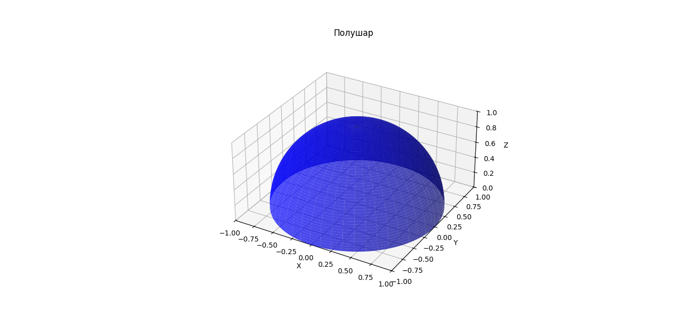
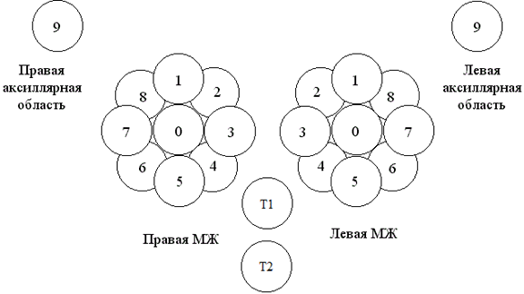
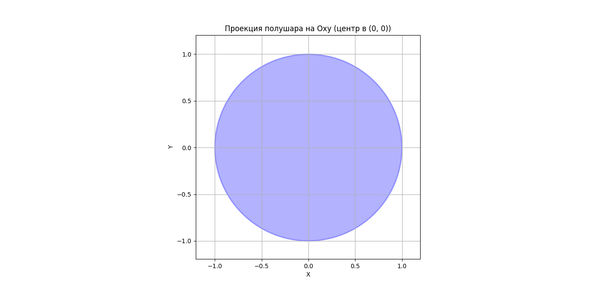
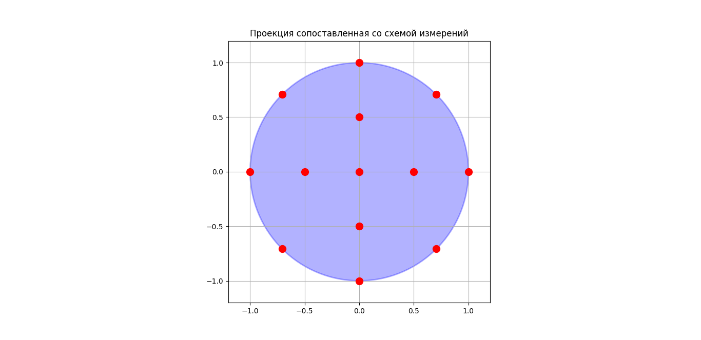
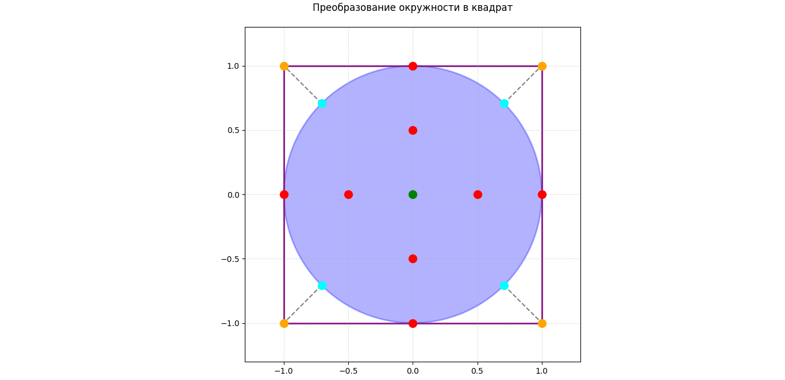
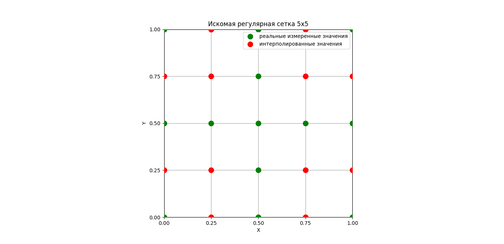

# RTMFeatureGenerator
Программная реализация обобщенного метода построения признаковых пространств с их последующим отбором.

# Краткое описание.
РТМ метод — это скрининговый метод для диагностики заболеваний с помощью данных о температурах. Он достаточно долгое время используется медиками на практике для диагностики рака молочной железы. Так как метод скрининговый, то проводиться он массово, а для качественной постановки диагноза требуется высоко квалифицированный врач-онколог. По этой причине возникает проблема качественной, массовой диагностики для решения которой предпринимается создание систем искусственного интеллекта, которые бы на основе температур могли хорошо отлавливать температурные аномалии и помогать человеку правильно ставить диагноз. При моделировании систем искусственного интеллекта одним из важнейших этапов является создание эффективного признакового пространства для решения изучаемой задачи. Ранее Лосевым Александром Георгиевичем, Владиславом Викторовичем Левшинским, Мазепой Еленой Алексеевной и другими участниками семинара были уже разработаны математические модели искусственного интеллекта для диагностики венозных заболеваний нижних конечностей, рака молочной железы, также активно ведутся исследования и по другим органам, например, лёгким, головному мозгу. В предыдущих исследованиях для построения признаков использовались некие общие идеи, соображения и подходы. Лосевым Александром Георгиевичем и Владиславом Викторовичем Левшинским был предложен метод построения и отбора признаков для диагностики рака молочной железы. В этом проекте предлагается некое обобщение и формализация предыдущих идей и работ по построению признаковых пространств для получения достаточно универсального метода, подходящего для разных органов и диагностических задач. Для достижения этой цели необходимо существующие идеи объединить и предпринять попытку их формализации, протестировать метод на различных задачах диагностики. Идейно метод стоит на двух столпах. Первый из них это биологическая и математическая симметрии органов, ее наличие характерно для здоровых, в то время как отсутствие – для больных. Второй – это физический подход к описанию температурных явлений. РТМ-метод основан на множестве физических законах и уравнениях математической физики, и чтобы учесть это, в признаковое пространство разумно добавлять информацию не только о значениях самих температур, но и об аналогах первых, вторых производных и краевых условиях. Для того, чтобы объяснить, как работает метод рассмотрим его на примере молочных желез. Орган можно представить в виде некоторой абстрактной фигуры, в случае голеней это некие цилиндры, в случае молочных желез – полушары. Рассмотрим полушар.

---

---

Рис 1. Полушар, представляющий молочную железу.

  Для удобства считаем, что полушар имеет единичный радиус. Врачи после проведения измерений, вообще говоря, рассматривают некоторую проекцию на плоскость, поэтому первый шаг аналогичный – проекция на плоскость.

  

Рис 2. Схема измерений молочных желез

После проекции мы имеем некоторый круг единичного радиуса на плоскости.

  
---

Рис 3. Проекция полушара на плоскость.
Следующий шаг – сопоставление полученной проекции со схемой измерений. 

 
---

Рис 4. Проекция, сопоставленная со схемой измерений.

Здесь представлен случай для достаточно больших молочных желез, когда медики добавляют точки для более корректного фиксирования температур. Произведем непрерывную деформацию в квадратную сетку с одинаковым расстоянием между элементами. Вписываем круг в квадрат так, чтобы длина стороны квадрата была равна диаметру круга. Граница круга отображается на границу квадрата с помощью непрерывного отображения с сохранением относительного расположения точек схемы измерений. 

 
---

Рис 5. Деформация окружности в квадрат.

В данном случае деформация произошла в квадратную сетку 5 на 5. В случае недостатка имеющихся точек, как в примере, для формирования полной сетки используется любая интерполяция для заполнения «пустых» значений. 

 
---

Рис 6. Полученная регулярная сетка.

Следующий шаг – переход к матрицам. Слева-направо и сверху-вниз записываются значения температур в соответствующих точкам на сетке. Так как температуры могут быть кожными и глубинными, то на каждую орган из пары приходится 2 матрицы. В случае если орган имеет опорные точки на каждую опорную точку приходиться еще 4 матрицы, если эти точки центральные и по 2 – если латеральные (то есть точки, относящиеся к левому или правому органу в паре). Далее используя ядра Собеля и конечноразностные аппроксимации можно получить матрицы аналогов первых и вторых производных. Для каждой пары точек проводиться прямая. Относительно каждой находятся симметричные точки. Группы симметричных точек объединяются в вектора. Также рассматриваются и точки симметричные относительно поворота. Находятся всевозможные вектора разной длины для всех прямых. Для каждой пары симметричных векторов считаются признаки, используя различные агрегатные функции.
После построения множества признаков необходимо отобрать наиболее оптимальное подмножество для решения конкретной задачи. Согласно определению информативности и информативной области из работ Лосева Александра Георгиевича и Владислава Викторовича Левшинского:
информативность – это некая величина, характеризующая то, насколько хорошо один класс отделяется от другого рассматриваемым признаком.
Определим величину W – это супремум по информативности по всем возможным подобластям числовой прямой, на которой информативность имеет смысл. Информативная область – это такое подмножество числовой прямой, на котором обеспечивается достижение величины W. Первым этапом отбора является оценка информативности, полученных признаков. Используется программный продукт реализующий алгоритм, описанный в книге Константина Вячеславовича Воронцова, модифицированный под задачи радиотермометрии для учета предметной области Лосевым Александром Георгиевичем, Владиславом Викторовичем Левшинским, Анастасией Сергеевной Резниковой. После оценки всех признаков и сопоставления им информативных областей, для каждой из пар симметричных векторов выбирается один наиболее информативный признак. Следующий шаг обработки – это отбор тех признаков, которые не имели бы сильную корреляцию между собой. Для этого подсчитывается матрица корреляций и оставляется набор признаков, максимизирующий суммарную информативность. При недостаточной уверенности в достоверности полученных признаков предлагается третий этап отбора – проведение различных статистических тестов и на их основе выделение меньшего подмножества из несильно коррелирующих признаков. Оценка алгоритмов классификации проводиться на всех отобранных множествах: первого, второго и третьего, при его наличии. В качестве метрики для оценки алгоритмов классификации использована эффективность, которая считается как среднее геометрическое из чувствительности и специфичности. 
Тестирование метода проводилось на трех разных задачах: классификация пациентов с заболеваниями молочной железы на «здоров/группа риска», в которой было 9162 пациента, из которых 8477 здоровых, 685 группы риска. Определения необходимости проведения сеансов КЦГ для пациентов с нарушением сознания, где 85 пациентов с измерениями температур до и после проведения сеансов КЦГ.  И диагностика заболеваний яичников, то есть классификация «здоров/болен», в которой было 717 здоровых и 48 больных. Были протестированы различные алгоритмы классификации: LDA, QDA, логистическая регрессия, случайный лес, градиентный бустинг, наивный байесовский классификатор. Обучение проводилось, используя стратифицированную кросс-валидацию с разделением на 5 фолдов. Для количественной балансировки использовалась техника оверсемплинга миноритарного класса SMOTE. 

Результаты (в случае молочных желез используется добавление признаков к уже существующим, предыдущий результат - значения без добавления):
| Диагностическая задача | Метрика эффективности | Предыдущий результат |
|-------------|-------------|-------------|
| Заболевания молочной железы | 0.910 (при добавлении) | 0.909 |
| Нарушения сознания (КЦГ) | 0.686  | Предыдущих результатов нет |
| Заболевания яичников | 0.696  | Предыдущих результатов нет |
